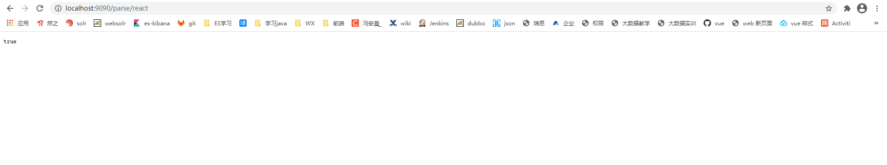
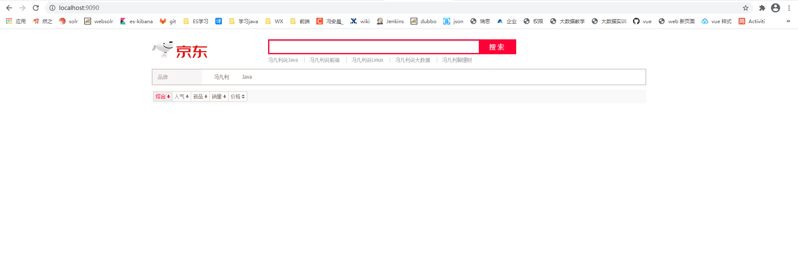
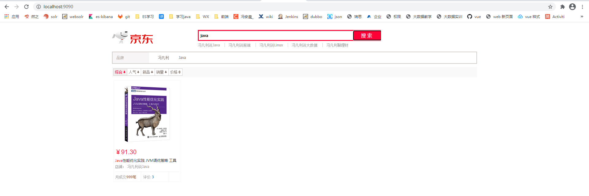
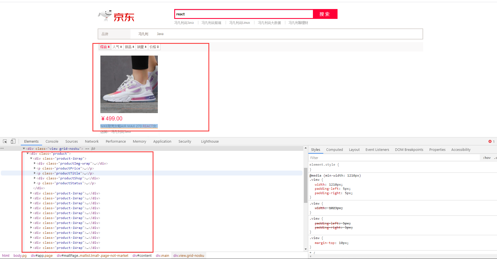

# 前言
## 1. 项目版本
springboot 2.2.5.RELEASE（从父模块的 pom.xml 中也可以看到）

## 2. 项目介绍

# 一、elasticsearch-transport 模块
## 1. 

# 二、elasticsearch-rest 模块
## 1. 

# 三、elasticsearch-jingdongSearch 模块
## 1. 项目 demo 测试
### 1. 项目版本： 
springboot 2.2.5.RELEASE  
elasticsearch 6.4.2  

### 2. 项目介绍：   
springboot 整合 rest 操作 elasticsearch，编写京东搜索demo。  
1. 从京东爬取数据存放到 ES 中  
2. 在业务层编写 es 的操作代码（存放数据和搜索数据），  
3. 搭建一个前端页面，一个搜索框  
4. 关键字高亮显示  

## 3. 页面展示和操作
1. 先调用 `localhost:9090/parse/java` 插入从京东爬取的 java 数据放入到es中  
   再调用 `localhost:9090/parse/vue` 插入从京东爬取的 vue 数据放入到es中  
   再调用 `localhost:9090/parse/react` 插入从京东爬取的 react 数据放入到es中  
   
2. 在浏览器输入 `localhost:9090` 进入到主页面
   
3. 输入 java等关键词 搜索，并显示数据，关键字并高亮
   
   
   
   

## 4. 现有问题
数据已经返回到前端，前端也已经高亮显示，但是数据只有一个。  

日后再维护

问题如下
    

